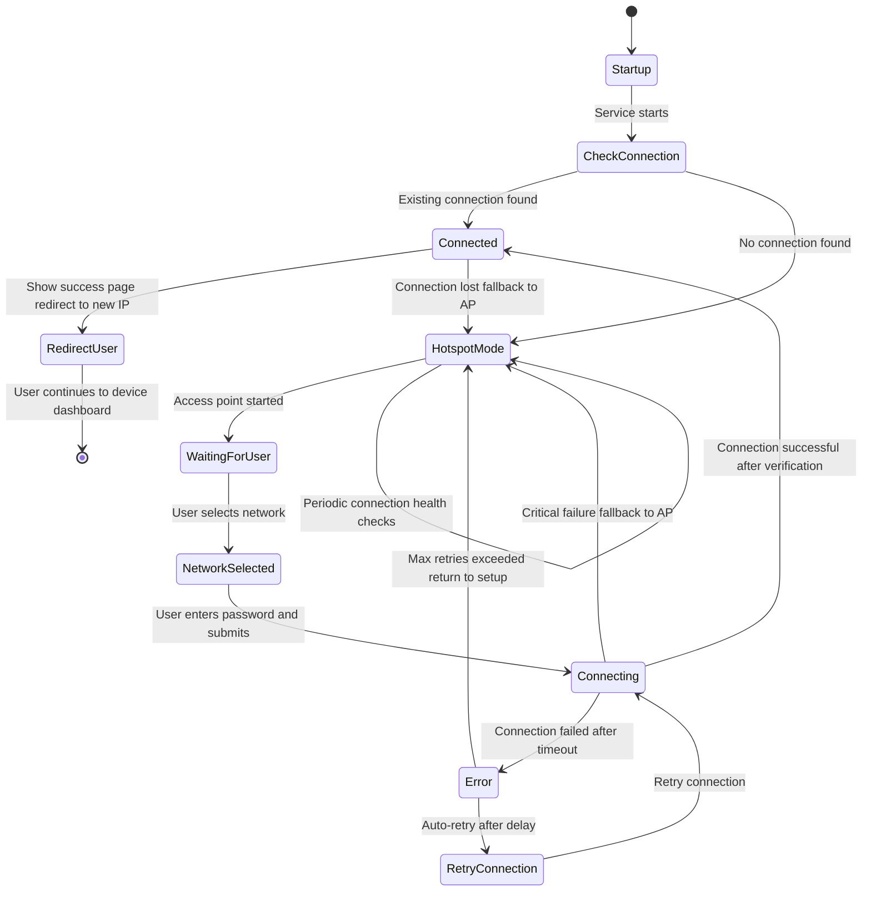

# Distiller WiFi Service

A production-ready WiFi setup service for Raspberry Pi CM5 devices. Provides a web-based interface for configuring WiFi connections with automatic hotspot fallback.

## Features

- **Automatic Hotspot Mode**: Creates a WiFi access point when no connection is available
- **Web Interface**: Clean, mobile-friendly interface for WiFi configuration
- **Single-Radio Support**: Properly handles single-radio WiFi hardware limitations
- **Connection Verification**: Multiple verification methods ensure reliable connections
- **E-ink Display Integration**: Optional support for status display on e-ink screens
- **Systemd Integration**: Runs as a system service with automatic startup
- **Production Ready**: Optimized logging and error handling

## Requirements

- Raspberry Pi CM5 or compatible device
- Python 3.8+
- NetworkManager
- Root privileges (for network management)

## Installation

1. **Clone the repository:**
   ```bash
   git clone <repository-url>
   cd distiller-cm5-services
   ```

2. **Install the service:**
   ```bash
   sudo bash install-service.sh
   ```

3. **Start the service:**
   ```bash
   sudo systemctl start distiller-wifi
   ```

## Usage

### Initial Setup

1. The service automatically starts in hotspot mode if no WiFi connection is detected
2. Connect to the "DistillerSetup" WiFi network (password: "setup123")
3. Navigate to http://localhost:8080 (or http://192.168.4.1:8080 if localhost fails) in your browser
4. Select your WiFi network and enter the password
5. The device will connect and redirect to the new network

### Service Management

```bash
# Check service status
sudo systemctl status distiller-wifi

# View logs
sudo journalctl -u distiller-wifi -f

# Restart service
sudo systemctl restart distiller-wifi

# Stop service
sudo systemctl stop distiller-wifi
```

### Configuration

The service can be configured via command line arguments:

```bash
python3 distiller_wifi_service.py --help
```

Options:
- `--ssid`: Hotspot SSID (default: DistillerSetup)
- `--password`: Hotspot password (default: setup123)
- `--port`: Web server port (default: 8080)
- `--device-name`: Device name for display (default: Distiller)
- `--no-eink`: Disable e-ink display support
- `--verbose`: Enable verbose logging

### URL Access

The web interface uses intelligent URL fallback:
1. **Primary**: `http://localhost:8080` - Works when connected to hotspot
2. **Secondary**: `http://127.0.0.1:8080` - Alternative localhost address  
3. **Fallback**: `http://192.168.4.1:8080` - Traditional hotspot IP

The system automatically tries each URL in order until one responds.

## Architecture

### Components

- **`distiller_wifi_service.py`**: Main service with Flask web interface
- **`network/wifi_manager.py`**: WiFi connection management with NetworkManager
- **`templates/`**: Web interface templates
- **`static/`**: CSS, JavaScript, and images for web interface

### State Management

The service operates in several states with automatic transitions and fallback mechanisms:



#### State Descriptions

- **Startup**: Initial service startup and system checks
- **CheckConnection**: Verify existing WiFi connectivity
- **HotspotMode**: Access point active (SSID: "DistillerSetup", Password: "setup123")
- **WaitingForUser**: Web interface available for network selection
- **NetworkSelected**: User has chosen a network, entering credentials
- **Connecting**: Attempting connection with timeout and verification
- **Connected**: Successfully connected with internet access verified
- **Error**: Connection failed, preparing for retry or fallback
- **RetryConnection**: Automatic retry with exponential backoff
- **RedirectUser**: Success page shown, redirecting to device dashboard

### Connection Flow & Scenarios

#### Scenario 1: First-Time Setup
1. **Device boots** → Service starts in `Startup` state
2. **No existing connection** → Transitions to `HotspotMode`
3. **Access point created** → "DistillerSetup" network appears
4. **User connects** → Web interface accessible at http://localhost:8080 (fallback: http://192.168.4.1:8080)
5. **Network selection** → User chooses "HomeWiFi" network
6. **Password entry** → User enters WiFi password
7. **Connection attempt** → Service transitions to `Connecting` state
8. **Success** → Connected to "HomeWiFi", redirects to http://192.168.1.100:8080
9. **Dashboard access** → User continues to device dashboard

#### Scenario 2: Connection Recovery
1. **Device running** → Currently in `Connected` state on "HomeWiFi"
2. **Network disruption** → Router reboots, connection lost
3. **Health check fails** → Service detects connection loss
4. **Automatic fallback** → Transitions to `HotspotMode`
5. **Access point restored** → "DistillerSetup" network available again
6. **User intervention** → Can reconfigure or wait for network recovery
7. **Network returns** → Automatic reconnection attempt
8. **Success** → Returns to `Connected` state

#### Scenario 3: Connection Failure with Retry
1. **User selects network** → Chooses "OfficeWiFi" with wrong password
2. **Connection attempt** → Service enters `Connecting` state
3. **Authentication fails** → Transitions to `Error` state
4. **Automatic retry** → Waits 5 seconds, retries connection
5. **Retry fails** → Waits 10 seconds, retries again
6. **Max retries exceeded** → Returns to `HotspotMode`
7. **User correction** → User enters correct password
8. **Successful connection** → Connects to "OfficeWiFi"

#### Scenario 4: Changing Networks
1. **Device connected** → Currently connected to "HomeWiFi"
2. **User wants to change** → Accesses device dashboard, clicks "Change Network"
3. **Instruction page shown** → Dedicated page with clear instructions and 10-second countdown
4. **User informed** → Page explains: disconnect, reconnect to "DistillerSetup", visit setup URL
5. **Network change initiated** → Service disconnects from "HomeWiFi" after countdown
6. **Hotspot activation** → Transitions to `HotspotMode`, starts "DistillerSetup" AP
7. **User reconnects** → User connects to "DistillerSetup" hotspot (password: setup123)
8. **Setup interface** → User visits http://localhost:8080 (or http://192.168.4.1:8080) for network selection
9. **New network selection** → User selects "GuestWiFi" network
10. **New connection** → Service connects to "GuestWiFi"
11. **Success** → Device now accessible on "GuestWiFi" network

## Web Interface

The web interface provides:
- Network scanning and selection
- Password entry for encrypted networks
- Real-time connection status
- Mobile-responsive design
- Automatic redirection after successful connection

## Security Features

- Runs with minimal required privileges
- Protected system paths
- Input validation and sanitization
- Automatic connection timeouts
- Secure password handling

## Troubleshooting

### Common Issues

**Service won't start:**
```bash
# Check service status
sudo systemctl status distiller-wifi

# Check logs for errors
sudo journalctl -u distiller-wifi -n 50
```

**Hotspot not appearing:**
- Ensure NetworkManager is running
- Check for conflicting WiFi services
- Verify device supports AP mode

**Connection failures:**
- Check network password
- Verify network is in range
- Review logs for specific error messages

### Logs

Service logs are available via systemd:
```bash
# Recent logs
sudo journalctl -u distiller-wifi -n 100

# Follow logs in real-time
sudo journalctl -u distiller-wifi -f

# Logs since last boot
sudo journalctl -u distiller-wifi -b
```

## Development

### Testing

Run the service in development mode:
```bash
sudo python3 distiller_wifi_service.py --verbose
```

### Dependencies

Core dependencies:
- Flask: Web framework
- python-networkmanager: NetworkManager integration
- dbus-python: D-Bus communication
- cachetools: Network scan caching

Optional dependencies:
- pillow, numpy: E-ink display support
- systemd-python: Enhanced systemd integration

## License

[License information]

## Support

For issues and support, please check the troubleshooting section above or review the service logs for specific error messages. 